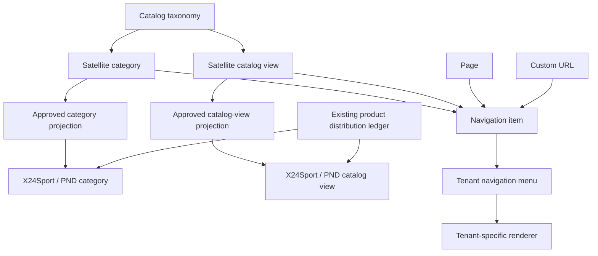

# Kế hoạch hợp nhất menu và danh mục đa tenant

> Ledger tiếp tục công việc cho menu, taxonomy, catalog view và việc phân phối
> danh mục lên các website tổng. Tài liệu này là checkpoint bắt buộc sau mỗi
> phase để công việc không phụ thuộc lịch sử hội thoại.

## Trạng thái

| Trường | Giá trị |
|---|---|
| Ngày baseline | 2026-08-22, Asia/Ho_Chi_Minh |
| Phạm vi | 11 tenant storefront đang hoạt động |
| Phase hiện tại | Phase 1 — hoàn tất |
| Production mutation trong Phase 1 | Chưa; schema đang chờ deploy theo runbook |
| CMS/frontend/cache đã tác động | Chưa trong Phase 1 local |
| Commit locator | `git log -1 --format=%H -- docs/navigation-unification-plan.md` |
| Phase kế tiếp | Phase 2 — projection category/catalog view lên website tổng |

### Checkpoint theo phase

| Phase | Trạng thái | Kết quả bắt buộc | Commit dự kiến |
|---|---|---|---|
| 0. Baseline và hợp đồng dữ liệu | **Hoàn tất** | Inventory source, public crawl, route defects, kiến trúc đích, rollout contract | `docs: establish navigation unification baseline` |
| 1. Schema CMS | **Hoàn tất local** | Taxonomy, catalog view, navigation menu/item, category distribution, feature flag | `feat(cms): add tenant navigation and catalog view schema` |
| 2. Projection lên website tổng | Chưa bắt đầu | Category/catalog-view projection idempotent tới X24Sport và PND Sport | `feat(cms): sync approved catalog projections to master tenants` |
| 3. Frontend adapter | Chưa bắt đầu | View model chung, legacy fallback, shadow manifest | `refactor(frontend): add legacy-safe navigation adapter` |
| 4. Backfill và cutover | Chưa bắt đầu | Draft backfill, shadow validation, chuyển từng tenant | Commit riêng theo tenant |
| 5. Tích hợp và vận hành | Chưa bắt đầu | Isolation, cache, responsive, crawl, rollback và runbook | `chore: complete tenant navigation unification` |

Không đánh dấu một phase là hoàn tất chỉ vì đã viết code. Phase chỉ hoàn tất khi
đạt toàn bộ nghiệm thu, cập nhật bảng trên và commit đúng phạm vi.

## Mục tiêu và giới hạn

### Mục tiêu

- CMS trở thành nguồn dữ liệu duy nhất cho nội dung menu, danh mục chuẩn và các
  catalog landing được biên tập.
- Mỗi tenant vẫn giữ giao diện, route và cách trình bày menu riêng.
- Danh mục/catalog view của tenant vệ tinh có thể được phân phối có chủ đích tới
  `x24sport` và `pndsport` bằng khóa nghiệp vụ ổn định, không dùng ID chéo tenant.
- Menu chỉ tham chiếu một đích điều hướng; menu không bị đồng nhất với category.
- Việc backfill và cutover không làm thay đổi URL, DOM anchor, CTA, tracking hoặc
  giao diện của `mayaochaybo.vn` và `mayaobongda.vn` trước khi shadow validation
  đạt 100%.

### Ngoài phạm vi

- Không thay thiết kế header/footer trong dự án hợp nhất nguồn dữ liệu này.
- Không thay Google Ads, GTM, Consent Mode, pixel, số điện thoại hoặc Zalo.
- Không tự động phân phối nội dung sang `rynosport`; đây là thương hiệu độc lập.
- Không thay worker phân phối sản phẩm đang dùng collection
  `catalog-distributions`. Navigation/category projection phải tích hợp với nó,
  không sửa nghĩa hoặc tái sử dụng sai collection sản phẩm hiện có.
- Không tạo mọi tổ hợp filter thành URL indexable.

## Quyết định kiến trúc không được phá vỡ

1. **Menu và đích điều hướng là hai lớp khác nhau.** Một item có thể trỏ tới
   category, catalog view, page, custom URL hoặc chỉ là group.
2. **Catalog view là thực thể hạng nhất.** Ví dụ `/ao-bong-da-mau-do/` là một
   landing lọc sản phẩm bằng `searchTagKey=color.red`, không phải category giả.
3. **Taxonomy dùng khóa chuẩn, ID vẫn tenant-scoped.** Không lưu hoặc sao chép ID
   quan hệ của tenant nguồn sang tenant đích.
4. **Phân phối là opt-in.** X24Sport và PND Sport chỉ nhận projection đã được bật;
   RynoSport không nhận mặc định.
5. **Sản phẩm và danh mục phải đồng thuận.** Master menu không hiện một projection
   chưa có target product hợp lệ trong ledger `catalog-distributions`.
6. **Route hiện hữu được bảo toàn.** Chuẩn hóa slash hoặc đổi path là một migration
   URL riêng, có 301/308 được kiểm chứng; backfill menu không được tự đổi URL.
7. **Server render và fallback cứng.** Frontend lấy menu trên server, không client
   fetch gây nhấp nháy. Dữ liệu CMS lỗi hoặc chưa `ready` phải quay về legacy menu.
8. **Cutover theo tenant.** Không đổi đồng thời hai tenant đang chạy quảng cáo.

## Baseline production đã kiểm chứng

### Phương pháp

- Đọc source của mọi header đặc thù, shared header, Store Settings, product
  category schema và filter constants.
- Đọc public Payload API theo `tenant.slug`, chỉ lấy `siteName`, `navigation` và
  category metadata.
- Render homepage production ở `1440x900` và `390x844` bằng browser; kiểm tra
  header, menu mobile, canonical và horizontal overflow.
- Crawl mọi URL HTTP(S) cùng host nằm trong semantic `<nav>` của homepage.
- Với redirect, theo tiếp tới URL cuối để phân biệt redirect hợp lệ và 404 bị che
  bởi redirect slash.

### Kết quả tổng

- 11/11 homepage trả `200` và có canonical đúng domain apex.
- 11/11 homepage không có horizontal overflow ở cả hai viewport.
- Đã kiểm tra 215 URL điều hướng nội bộ duy nhất.
- 204 URL kết thúc ở `2xx`.
- 11 URL kết thúc ở `404` và là blocker trước cutover.
- Mayaobongchuyen phát 14 link không có trailing slash; cả 14 trả `308`, nhưng chỉ
  4 URL kết thúc ở `200`, 10 URL kết thúc ở `404`.

### Crawl theo tenant

| Tenant | URL kiểm tra | Final 2xx | Redirect ban đầu | Final 404 | Ghi chú |
|---|---:|---:|---:|---:|---|
| `x24sport` | 45 | 45 | 0 | 0 | Menu sport/category từ CMS cộng link code |
| `rynosport` | 3 | 3 | 0 | 0 | Header tối giản, hard-code |
| `pndsport` | 45 | 45 | 0 | 0 | Category tree từ CMS |
| `mayaobongda` | 17 | 17 | 0 | 0 | Menu động theo category/productCount cộng link code |
| `mayaocaulong` | 18 | 18 | 0 | 0 | Catalog view/filter hard-code |
| `mayaopickleball` | 18 | 18 | 0 | 0 | Catalog view/filter hard-code |
| `mayaobongchuyen` | 16 | 6 | 14 | 10 | Production đang rơi vào fallback code |
| `mayaobongro` | 13 | 12 | 0 | 1 | Link `/lien-he/` hỏng |
| `mayaochaybo` | 23 | 23 | 0 | 0 | Tenant quảng cáo; không cutover sớm |
| `mayaodongphuc` | 4 | 4 | 0 | 0 | Category trong mega menu đến từ CMS |
| `dongphucx24` | 13 | 13 | 0 | 0 | Header/category source là code |

### URL 404 bắt buộc xử lý trước cutover

`mayaobongchuyen.vn`:

- `/ao-bong-chuyen-nam/`
- `/ao-bong-chuyen-nu/`
- `/ao-doi-clb/`
- `/ao-bong-chuyen-mau-do/`
- `/ao-bong-chuyen-mau-xanh/`
- `/ao-bong-chuyen-mau-den/`
- `/ao-bong-chuyen-mau-trang/`
- `/ao-bong-chuyen-mau-vang/`
- `/ao-bong-chuyen-mau-hong/`
- `/lien-he/`

`mayaobongro.vn`:

- `/lien-he/`

Không sửa các URL này trong Phase 0. Phase 4 của tenant tương ứng bị chặn cho tới
khi route hoặc redirect đích được triển khai và crawl lại đạt `2xx`.

## Inventory nguồn menu hiện tại

`Store Settings.navigation` hiện chỉ là mảng phẳng `{label, href}`. Sự tồn tại
của dữ liệu trong trường này không có nghĩa storefront đang dùng nó.

| Tenant | Category public | `Store Settings.navigation` public | Nguồn menu production thực tế | Độ phức tạp cutover |
|---|---:|---|---|---|
| `x24sport` | 124 | 8 item, không được shared header dùng | `getCategoryNavigation()` từ `product-categories`; home/blog/contact/pricing ở code | Trung bình |
| `rynosport` | 115 | Không có Store Settings public | 3 header link và footer link hard-code | Thấp |
| `pndsport` | 128 | 9 item, không được shell dùng | Category tree từ CMS; blog/hotline ở code | Trung bình |
| `mayaobongda` | 84 | 6 item cũ, không được header dùng | Type/collection/audience từ CMS; utility link và rule trình bày ở code | Rất cao |
| `mayaocaulong` | 0 | 3 anchor cũ, không được header dùng | Header, 3 type view và 9 color view ở code | Cao |
| `mayaopickleball` | 32 | Mảng rỗng | Header, 3 type view và 9 color view ở code; category CMS không phải nguồn menu | Cao |
| `mayaobongchuyen` | 0 | Không có Store Settings public | Code có adapter đọc CMS nhưng production dùng `fallbackNavigation` và `fallbackCategories` | Rất cao |
| `mayaobongro` | 23 | Mảng rỗng | 7 header link hard-code; footer link hard-code | Trung bình |
| `mayaochaybo` | 14 | Mảng rỗng | 6 sample link, 9 color view, 5 utility link ở code | Rất cao |
| `mayaodongphuc` | 7 | 8 item cũ, không được header dùng | 7 category mega-menu từ CMS; quy trình/vật liệu/tiêu chuẩn/blog ở code | Trung bình |
| `dongphucx24` | 0 | 8 item có slug khác source UI | 6 category mẫu và toàn bộ header/footer ở code | Cao |

### Kết luận inventory

- Không tenant nào đang có một menu CMS cấu trúc đủ để làm nguồn chuẩn đa tenant.
- `x24sport`, `pndsport`, `mayaobongda` và `mayaodongphuc` đã dùng category CMS
  ở một phần menu; đây là dữ liệu động, không được backfill thành snapshot tĩnh.
- `mayaobongchuyen` không phải canary an toàn dù code có luồng đọc CMS: public API
  hiện không trả Store Settings hoặc category của tenant, nên production dùng
  fallback code và đang phát link hỏng.
- Store Settings của `mayaocaulong`, `mayaobongda`, `mayaodongphuc` và
  `dongphucx24` chứa dữ liệu cũ/không khớp UI. Không được lấy mảng này làm input
  backfill nếu chưa đối chiếu manifest production.

## Cây điều hướng mục tiêu

```text
Homepage (/)
├── Header navigation
│   ├── Product/category hub
│   │   ├── Category target
│   │   ├── Catalog view target
│   │   └── Dynamic category/catalog-view query
│   ├── Page target
│   └── CTA/contact target
├── Context navigation
│   ├── Primary filter row
│   ├── Secondary catalog-view links
│   └── Breadcrumbs
└── Footer navigation
    ├── Product/category hubs
    ├── Buyer guidance
    ├── Company/contact
    └── Legal/social
```



## Hợp đồng dữ liệu đích

### 1. `catalog-taxonomies` — từ điển chuẩn toàn hệ thống

Collection toàn cục, chỉ super admin/distribution worker được sửa:

- `key`: khóa ASCII bất biến, ví dụ `sport.football`, `color.red`,
  `audience.school`, `type.sleeveless`.
- `kind`: `sport | type | audience | color | collection | tag`.
- `parent`: quan hệ trong cùng taxonomy tree.
- `name`: tên nội bộ chuẩn; không bắt buộc là nhãn hiển thị của tenant.
- `aliases`: các tên/slug cũ dùng cho migration, không dùng để join runtime.
- `status`: `active | retired`.

Khóa seed sport ban đầu:

| Taxonomy key | Tenant vệ tinh chuyên môn | Projection ở X24Sport/PND Sport |
|---|---|---|
| `sport.football` | `mayaobongda` | `bong-da` |
| `sport.badminton` | `mayaocaulong` | `cau-long` |
| `sport.pickleball` | `mayaopickleball` | `pickleball` |
| `sport.volleyball` | `mayaobongchuyen` | `bong-chuyen` |
| `sport.basketball` | `mayaobongro` | `bong-ro` |
| `sport.running` | `mayaochaybo` | `chay-bo` |
| `business.uniform` | `dongphucx24` / workshop `mayaodongphuc` | `dong-phuc` |

`rynosport` giữ taxonomy riêng ở vai trò thương hiệu độc lập và không tự tạo
projection tới website tổng.

### 2. Mở rộng `product-categories`

- `taxonomy`: relationship tới `catalog-taxonomies`.
- `navigationLabel`: override nhãn trong menu của chính tenant.
- `showInNavigation`: cờ biên tập cục bộ; không đồng nghĩa phân phối.
- `navigationOrder`: thứ tự cục bộ.
- `status`: `active | hidden | retired` hoặc dùng draft/publish nếu collection
  được bật versioning.

Giữ `slug`, `legacyPath`, `tenantSlugKey`, `group`, `parent`, `productCount` và
`order` hiện hữu để tương thích. Validation phải chặn parent/category khác tenant.

### 3. `catalog-views` — landing catalog có truy vấn

Collection tenant-scoped, có draft/versioning:

- `tenant`, `key`, `path`, `title`, `heading`, `description`.
- `taxonomy`: một hoặc nhiều khóa chuẩn mô tả view.
- `filters`: bộ lọc có schema, không lưu query string tùy ý.
- `matchMode`: `all | any`.
- `indexPolicy`: `indexable | noindex`.
- `canonicalPath`, `includeInSitemap`, `enabled`.
- `distribution`: target master được duyệt và label/order override nếu cần.

Filter tối thiểu của Phase 1:

- `sportKey`
- `categoryKeys`
- `searchTagKeys`
- `productTypeKeys`
- `audienceKeys`

Ví dụ:

```json
{
  "tenant": "mayaobongda",
  "key": "football.color.red",
  "path": "/ao-bong-da-mau-do/",
  "filters": {
    "sportKey": "sport.football",
    "searchTagKeys": ["color.red"]
  },
  "indexPolicy": "indexable"
}
```

Không lưu logic lọc trong navigation item và không ép view này thành
`product-category`.

### 4. Chuẩn hóa `searchTags`

`Products.searchTags` và `Media.searchTags` hiện chỉ có `value`. Phase 1 bổ sung
`key` nhưng giữ nguyên `value` để tương thích:

```json
{ "key": "color.red", "value": "đỏ" }
```

- Query catalog view mới dùng exact `key`, không dùng `contains` trên tiếng Việt.
- Backfill key phải idempotent và có báo cáo item không ánh xạ được.
- Frontend cũ tiếp tục đọc `value` trong giai đoạn legacy.
- Không tự gán một tag mơ hồ như `xanh` vào một sắc cụ thể nếu thiếu bằng chứng.

### 5. `navigation-menus`

Collection tenant-scoped, có version/draft:

- `tenant`, `key`, `location`: `header | mobile | footer | contextual`.
- `status`: `draft | ready | published | archived`.
- `revision`, `manifestHash`, `lastValidatedAt`.
- Unique: `tenant + key + location`.

Desktop và mobile có thể dùng cùng menu key với presentation khác. Chỉ tạo menu
riêng khi nội dung thực sự khác; không nhân đôi dữ liệu chỉ vì breakpoint.

### 6. `navigation-items`

Collection tenant-scoped, adjacency list để hỗ trợ tối đa ba cấp:

- `menu`, `tenant`, `key`, `parent`, `order`, `enabled`.
- `label`, `description`, `iconKey`, `featured`.
- `targetType`: `category | catalogView | page | customUrl | group`.
- Quan hệ target tương ứng; đúng một target được phép có giá trị.
- `childrenSource`: `manual | categoryQuery | catalogViewQuery`.
- Dynamic query có `group`, `taxonomyRoot`, `minimumProductCount`, `sort`, `limit`.
- Unique: `tenant + menu + key`.

Validation bắt buộc:

- Menu, item, parent và target tenant phải trùng nhau.
- Không cho chu trình parent và không sâu quá ba cấp.
- `group` không có href giả; `customUrl` phải qua allowlist protocol.
- Category query của Mayaobongda giữ rule collection có `productCount > 0`, sort
  năm giảm dần; không snapshot năm hiện tại vào menu.

### 7. `category-distributions`

Collection mới cho category/catalog-view projection. Không sửa nghĩa collection
`catalog-distributions` hiện dành cho **product**.

- Unique tuple: `sourceTenant + sourceKind + sourceRecord + targetTenant`.
- `sourceKind`: `category | catalogView`.
- Quan hệ source/target tương ứng.
- `status`: dùng cùng ngôn ngữ trạng thái với product ledger khi phù hợp:
  `ready | draft_created | published | needs_review | blocked | archived`.
- `copyMode`, `sourceFingerprint`, `targetFingerprint`, `syncedAt`, `lastError`.
- `showInNavigation`, `labelOverride`, `orderOverride` ở target.

Worker projection phải kiểm tra ledger sản phẩm hiện có trước khi cho
`showInNavigation=true`, để master không phát sinh category rỗng.

### 8. Feature flag trong Store Settings

Thêm:

```text
navigationMode = legacy | cms
```

- Mọi tenant khởi tạo ở `legacy`.
- Adapter được deploy trước nhưng vẫn render legacy.
- Khi `cms`, menu thiếu, sai tenant, chưa `ready` hoặc query lỗi phải fallback
  legacy và log server-side.
- Rollback là đổi về `legacy` và revalidate đúng tenant; không cần deploy mới.

## URL map và link policy

| Target | URL mẫu | Crawl/index mặc định | Menu có được trỏ tới? |
|---|---|---|---|
| Category master | `/danh-muc/bong-da/` | Indexable, self-canonical | Có |
| Category specialist | Legacy path đã duyệt | Indexable nếu có nội dung/sản phẩm | Có |
| Curated catalog view | `/ao-bong-da-mau-do/` | Indexable khi có giá trị riêng | Có |
| Temporary UI filter | Query/filter state | Không sitemap; policy crawl có giới hạn | Không dùng làm link menu chính |
| Search result | `/tim-kiem/?q=...` | Không phải đường discovery duy nhất | Không dùng thay category/view |
| Page | `/bang-gia-.../`, `/blog/` | Theo page policy | Có |
| Contact action | `tel:`, Zalo hoặc page nội bộ | Không phải taxonomy | CTA riêng |

Mỗi trang indexable phải có ít nhất một inbound link crawlable, canonical đúng
tenant, breadcrumb phù hợp route và sitemap policy nhất quán. Migration không
được tạo tổ hợp facet vô hạn.

## View model frontend

`getNavigationMenu(tenantSlug, location)` trả output trung lập:

```ts
type NavigationNode = {
  key: string
  label: string
  description?: string
  href?: string
  kind: 'category' | 'catalogView' | 'page' | 'customUrl' | 'group'
  activePatterns: string[]
  featured?: boolean
  iconKey?: string
  children: NavigationNode[]
}
```

Renderer tenant chỉ quyết định layout, hover/click, icon và responsive behavior.
Nhãn, href, thứ tự, enabled và cây item đến từ view model.

## Backfill và shadow validation

### Backfill chung

1. Trích xuất manifest production hiện tại từ rendered DOM và source động.
2. Upsert taxonomy/category/catalog view bằng stable key.
3. Upsert menu/item ở trạng thái draft với idempotency key dạng
   `<tenant>:<location>:<item-key>`.
4. Giữ `navigationMode=legacy`.
5. Render CMS view model ở local/shadow; không cho public traffic dùng.
6. So sánh label, href, order, hierarchy, desktop/mobile visibility, CTA,
   active state và manifest hash.
7. Chỉ đổi menu sang `ready` khi diff bằng 0 hoặc mọi khác biệt đã được duyệt.

### Hai tenant đang chạy quảng cáo

`mayaochaybo.vn` và `mayaobongda.vn` luôn theo trình tự:

```text
draft backfill
  -> navigationMode=legacy
  -> local render với production data
  -> shadow manifest diff = 0
  -> deploy adapter với legacy fallback
  -> cutover một tenant ngoài peak ads
  -> theo dõi
  -> mới cutover tenant còn lại
```

Thứ tự: `mayaochaybo` trước, `mayaobongda` sau. Không đổi Ads, GTM, CTA hoặc
landing routes trong cùng batch.

## Kế hoạch triển khai chi tiết

### Phase 0 — Baseline và hợp đồng dữ liệu — hoàn tất

Đã hoàn tất:

- Inventory 11 tenant và nguồn menu thực tế.
- Đối chiếu Store Settings/category public với source render.
- Baseline desktop/mobile và canonical homepage.
- Crawl 215 URL navigation; ghi nhận 11 final 404.
- Chốt data model, access boundary, feature flag, shadow/cutover và rollback.
- Chốt X24Sport/PND Sport là projection targets; RynoSport không tự nhận dữ liệu.

Nghiệm thu Phase 0: **đạt**. Các URL 404 là baseline defect đã biết và trở thành
blocker của Phase 4, không làm mất tính hoàn tất của inventory.

### Phase 1 — Schema CMS và migration idempotent

Trạng thái: **hoàn tất local, sẵn sàng deploy CMS**.

Đã triển khai:

- Thêm `catalog-taxonomies`, `catalog-views`, `navigation-menus`,
  `navigation-items` và `category-distributions`; các collection tenant-owned đã
  được thêm vào multi-tenant plugin, còn taxonomy/projection giữ quyền super
  admin đúng hợp đồng.
- Mở rộng category, product/media search tags và Store Settings theo hướng tương
  thích ngược; mọi tenant vẫn mặc định `navigationMode=legacy`.
- Thêm validation stable key, URL allowlist, target union, cùng-tenant,
  depth/cycle và exact-match catalog query.
- Migration `20260822_110000_navigation_unification_schema` có `up/down`, chỉ
  chứa schema navigation mới; test database riêng đã chạy `up -> up -> down`
  thành công và giữ nguyên bảng baseline.
- `generate:types`, `generate:importmap`, TypeScript, CMS production build,
  navigation schema test, tenant identity test và media sharing access test đều
  đạt ngày 2026-08-22.

Công việc:

1. Thêm `catalog-taxonomies`, `catalog-views`, `navigation-menus`,
   `navigation-items`, `category-distributions` vào Payload multi-tenant config
   đúng phạm vi.
2. Mở rộng `product-categories`, Product/Media search tags và Store Settings.
3. Thêm access control: tenant admin chỉ thấy/sửa menu, view, category của tenant;
   super admin/worker quản trị taxonomy và projection chéo tenant.
4. Thêm validation tenant identity, target union, depth/cycle và URL protocol.
5. Thêm migrations có `up/down`, generated types và import map nếu có admin UI.
6. Viết seed/backfill key dạng dry-run mặc định; chạy lại không duplicate.

Nghiệm thu:

- Tạo menu/category/catalog view tenant A không thể chọn target tenant B.
- Taxonomy key và distribution tuple unique ở database.
- Catalog view exact-match `searchTagKey` trả đúng sản phẩm.
- Migration chạy lại không thay kết quả.
- `pnpm exec tsc --noEmit`, generate types/import map và build CMS pass.

Không đổi frontend source hoặc `navigationMode` trong Phase 1.

### Phase 2 — Projection category/catalog view tới website tổng

Công việc:

1. Xây worker `syncMasterCatalogProjection` cho `x24sport` và `pndsport`.
2. Resolve source/target bằng taxonomy/view key, không dùng ID nguồn.
3. Upsert `category-distributions`; không đụng `catalog-distributions` của product.
4. Chỉ bật target navigation khi target có product `published` hợp lệ trong
   product distribution ledger.
5. Tôn trọng `manual_locked`, label/order override và trạng thái review.
6. Revalidate đúng source/target tenant bằng tag có chủ đích.

Nghiệm thu:

- Chạy worker hai lần không tạo record/projected category trùng.
- Bật/tắt source chỉ tác động tuple được duyệt.
- X24Sport và PND Sport không hiện category rỗng.
- RynoSport không thay đổi.
- Tenant admin không đọc quan hệ ngoài các tenant liên quan.

### Phase 3 — Adapter navigation chung

Công việc:

1. Tạo server data function và typed view model.
2. Thêm legacy adapters cho từng header hiện tại; legacy code vẫn còn.
3. Tạo manifest serializer/diff dùng cho backfill và CI regression.
4. Shared adapter trước; renderer tenant đặc thù sau, không đổi visual.
5. Fallback cứng khi CMS lỗi/chưa ready; log không chứa secret.

Nghiệm thu:

- `navigationMode=legacy` render byte/semantic-equivalent với baseline cần giữ.
- `navigationMode=cms` local render đúng manifest CMS.
- Không client fetch/hydration thêm vào header server-rendered.
- Keyboard, Escape, focus, anchor href và active state giữ nguyên.
- Frontend typecheck/build pass.

### Phase 4 — Backfill và cutover từng tenant

Thứ tự dựa trên baseline mới, thay cho thứ tự phỏng đoán ban đầu:

1. `rynosport`: canary menu đơn giản, không có dynamic group.
2. `x24sport`, `pndsport`: đang có category tree CMS; xác nhận projection target.
3. `mayaodongphuc`: dynamic category + utility links.
4. `dongphucx24`: tạo category records trước vì hiện public category = 0.
5. `mayaocaulong`, `mayaopickleball`: catalog views từ filter/search tag.
6. `mayaobongro`: chỉ sau khi `/lien-he/` hết 404.
7. `mayaobongchuyen`: chỉ sau khi có category/settings thật và 10 URL hết 404.
8. `mayaochaybo`: shadow/cutover ngoài peak ads.
9. `mayaobongda`: cuối cùng; giữ category query collection/audience động.

Mỗi tenant phải có:

- dry-run backfill;
- manifest diff legacy/CMS;
- URL crawl final status;
- desktop `1440x900`, mobile `390x844` và keyboard test;
- CMS access/isolation test;
- cutover ledger timestamp, revision, commit và rollback command;
- commit task-scoped riêng.

### Phase 5 — Tích hợp, production và theo dõi

- Test category + catalog view + product distribution trên ít nhất ba satellite.
- Test X24Sport và PND Sport projection, tắt/bật, manual lock và retry.
- Test cache/revalidation và rollback `cms -> legacy`.
- Crawl header/footer/mobile, sitemap, canonical, robots và breadcrumbs.
- Kiểm tra 390x844, 1440x900 và breakpoint của từng renderer.
- Deploy theo `PRODUCTION-DEPLOYMENT-RUNBOOK.md`; không sửa source trực tiếp qua SSH.
- Theo dõi logs/HTTP sau cache window và cập nhật checkpoint cuối.

## Quality gates bắt buộc

### CMS

```bash
cd cms-api
pnpm exec tsc --noEmit
pnpm payload generate:types
pnpm payload generate:importmap
pnpm run build
```

### Frontend

```bash
cd cms-frontend
pnpm typecheck
pnpm build
```

### Public regression

- Homepage/canonical đúng tenant.
- Mọi href menu trả final `2xx` hoặc redirect đã duyệt.
- Không có cross-tenant label, route, product hoặc media.
- Header/mobile/footer dùng anchor crawlable cho navigation.
- Menu keyboard-operable; focus-visible, Escape và focus return hoạt động.
- Không horizontal overflow ở 390x844 và 1440x900.
- Không thay GTM/Ads/Consent/CTA trong batch cutover.

## Rollback contract

- Schema migration rollback theo migration `down` chỉ dùng khi đã xác nhận không
  làm mất dữ liệu cần giữ; ưu tiên tắt feature trước.
- Runtime rollback: `navigationMode=cms -> legacy`, revalidate đúng tenant.
- Projection rollback: chuyển ledger sang `archived/blocked`, không xóa lịch sử và
  không xóa target product/category nếu vẫn được tham chiếu.
- Không xóa legacy menu source cho tới khi tenant đã qua ít nhất một vòng kiểm tra
  production và rollback drill.
- Không rollback bằng chỉnh file trực tiếp trên server.

## Risk register

| Rủi ro | Bằng chứng baseline | Mitigation | Trạng thái |
|---|---|---|---|
| Link menu hỏng | 10 URL Mayaobongchuyen, 1 URL Mayaobongro final 404 | Fix route/redirect trước Phase 4 | Open |
| Store Settings cũ bị dùng nhầm | Nhiều tenant có navigation khác UI hoặc không dùng | Backfill từ rendered manifest + source, không seed mù | Controlled |
| Tenant không có category CMS | Mayaocaulong, Mayaobongchuyen, DongphucX24 public = 0 | Tạo data draft trước adapter/cutover | Open |
| Màu/type không nhất quán | Slug/tag khác nhau giữa football, pickleball, running, basketball | Canonical taxonomy + exact searchTag key | Open |
| Category rỗng trên website tổng | Master có category `dong-phuc` productCount 0 | Gate bằng product distribution ledger | Controlled |
| Trùng worker phân phối | Product ledger đã tồn tại với 2.072 record X24 | Tách `category-distributions`, chỉ tích hợp trạng thái | Controlled |
| Ảnh hưởng Ads | Mayaochaybo và Mayaobongda đang chạy quảng cáo | Legacy mode, shadow diff, cutover nối tiếp | Controlled |
| Cache làm rollback chậm | Revalidation 60–300 giây tùy tenant | Tenant tag revalidation khi đổi mode | Open trong Phase 3 |

## Cách tiếp tục sau khi context bị rút gọn

1. Mở file này và đọc bảng checkpoint.
2. Chạy `git status --short --branch`; không chạm thay đổi ngoài task.
3. Xác nhận commit Phase gần nhất bằng commit locator.
4. Chỉ bắt đầu phase kế tiếp nếu phase trước có nghiệm thu và commit.
5. Sau mỗi phase: cập nhật trạng thái, bằng chứng, migration/data mutation,
   production/cache, remaining risk và commit SHA/locator trong file này.
