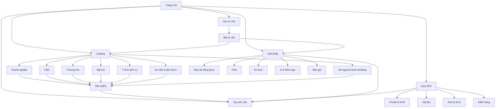

# Kiến trúc website mục tiêu

Ngày khởi tạo: 2026-08-20  
Mô hình: hybrid B2B catalog + lead generation + knowledge base

## 1. Mục tiêu

1. Đưa người mua từ bối cảnh sử dụng đến mẫu/cấu hình phù hợp trong tối đa ba
   lượt điều hướng.
2. Sở hữu các intent giao dịch quan trọng mà không tạo trang mỏng hoặc trùng
   từ khóa.
3. Biến nội dung tư vấn thành công cụ chuẩn bị brief và giảm rủi ro mua B2B.
4. Giữ catalog và mọi nội dung tenant-scoped; không trộn catalog thể thao từ
   tenant khác.

## 2. Cấu trúc mục tiêu

```text
Trang chủ (/)
├── Catalog (/san-pham/)
│   ├── Đồng phục doanh nghiệp (/danh-muc/dong-phuc-doanh-nghiep/)
│   ├── Đồng phục F&B (/danh-muc/dong-phuc-fnb/)
│   ├── Đồng phục trường học (/danh-muc/dong-phuc-truong-hoc/)
│   ├── Đồng phục bảo hộ (/danh-muc/dong-phuc-bao-ho/)
│   ├── Đồng phục y tế & dịch vụ (/danh-muc/dong-phuc-y-te-dich-vu/)
│   ├── Đồng phục sự kiện & đội nhóm (/danh-muc/dong-phuc-su-kien-doi-nhom/)
│   └── Đồng phục dã ngoại/team building (/danh-muc/dong-phuc-da-ngoai-team-building/)
│       └── Sản phẩm (/san-pham/{slug}/)
├── Giải pháp
│   ├── May áo đồng phục (/may-ao-dong-phuc/)
│   ├── Áo polo đồng phục (/ao-polo-dong-phuc/)
│   ├── Áo thun đồng phục (/ao-thun-dong-phuc/)
│   ├── In & thêu logo (/in-theu-logo-ao-dong-phuc/)
│   └── Báo giá đồng phục (/bao-gia-ao-dong-phuc/)
├── Quy trình (/quy-trinh-dat-may/)
│   ├── Chuẩn bị brief (/huong-dan-gui-yeu-cau/)
│   ├── Vật liệu (/vat-lieu/)
│   ├── Size & form (/size-va-form/)
│   └── Kiểm hàng & nghiệm thu (/kiem-hang-nghiem-thu/)
├── Góc tư vấn (/blog/)
│   └── Bài viết (/blog/{slug}/)
├── Dự án/case study (/du-an/) [chỉ mở khi có quyền dùng dữ liệu khách hàng]
│   └── Case (/du-an/{slug}/)
└── Tạo yêu cầu tư vấn (/#nhan-bao-gia hoặc /yeu-cau-tu-van/)
```

Các URL “Giải pháp/Quy trình” là roadmap, chưa mặc định đã tồn tại. Chỉ publish
khi có nội dung đầy đủ, CTA hoạt động và canonical riêng.

## 3. Visual sitemap



## 4. URL map và ưu tiên

| Trang | URL | Vai trò | Nav | Ưu tiên |
|---|---|---|---|---|
| Trang chủ | `/` | định vị + route theo nhu cầu | header/logo | P0 |
| Catalog | `/san-pham/` | duyệt toàn bộ mẫu | header | P0 |
| 7 category hiện có | `/danh-muc/{slug}/` | intent ngành/use case | catalog dropdown | P0 |
| Product | `/san-pham/{slug}/` | mẫu cụ thể + tạo brief | contextual | P0 |
| May áo đồng phục | `/may-ao-dong-phuc/` | commercial hub rộng | header/solutions | P0 |
| Báo giá | `/bao-gia-ao-dong-phuc/` | giải thích cấu phần + lead | header CTA/contextual | P0 |
| Polo | `/ao-polo-dong-phuc/` | type intent | solutions | P1 |
| Áo thun | `/ao-thun-dong-phuc/` | type intent | solutions | P1 |
| In & thêu | `/in-theu-logo-ao-dong-phuc/` | technique intent | solutions | P1 |
| Quy trình | `/quy-trinh-dat-may/` | trust + procurement | header | P1 |
| Vật liệu | `/vat-lieu/` | decision tool | process/header dropdown | P1 |
| Size & form | `/size-va-form/` | buyer enablement | process | P1 |
| Blog | `/blog/` | knowledge hub | header | P1 |
| Case study | `/du-an/{slug}/` | proof | footer/contextual | P2/gated |
| Local landing | `/may-dong-phuc-{dia-phuong}/` | local transaction | SEO/contextual | P2/gated |

## 5. Header và footer

### Header mục tiêu

1. Catalog
2. Giải pháp
3. Quy trình
4. Vật liệu & size
5. Góc tư vấn
6. CTA: Tạo yêu cầu

Hiện header dùng anchor `#quy-trinh`, `#vat-lieu`, `#tieu-chuan`. Giữ anchor cho
đến khi các landing P1 đủ chất lượng; sau đó 301/canonical hoặc đổi link trực
tiếp theo route được triển khai.

### Footer

- Theo nhu cầu: 7 category.
- Hỗ trợ lựa chọn: quy trình, vật liệu, size, in/thêu, báo giá.
- Nội dung: blog, case study khi có.
- Pháp lý/liên hệ: chính sách dữ liệu, điều khoản, kênh liên hệ đã xác minh.

Không dùng địa chỉ, hotline, Zalo, social hoặc email từ tenant khác nếu Store
Settings của tenant chưa xác nhận.

## 6. Breadcrumb

- `Trang chủ > Catalog > Đồng phục doanh nghiệp`
- `Trang chủ > Đồng phục doanh nghiệp > {Tên mẫu}`
- `Trang chủ > Góc tư vấn > {Tên bài}`
- `Trang chủ > Giải pháp > Áo polo đồng phục`

Schema BreadcrumbList chỉ triển khai khi breadcrumb hiển thị và URL khớp thực
tế.

## 7. Liên kết nội bộ

### Hub → spoke

- `/may-ao-dong-phuc/` → 7 category, polo, áo thun, quy trình, báo giá.
- Category → sản phẩm trong category, bài chọn vải/logo/size phù hợp.
- `/quy-trinh-dat-may/` → brief, vật liệu, size, kiểm hàng, báo giá.
- `/bao-gia-ao-dong-phuc/` → category, logo, vật liệu, form brief.

### Spoke → conversion

Mỗi bài blog có:

- 1 link về commercial hub/category chính;
- 1–2 link tới bài quyết định liên quan;
- 1 link tới catalog/mẫu phù hợp;
- CTA tạo brief với dữ liệu ngữ cảnh (không để browser chọn tenant).

### Product → education

Trang sản phẩm link tới:

- category sở hữu;
- hướng dẫn vật liệu được gợi ý;
- hướng dẫn in/thêu cho logo;
- size/form;
- tạo yêu cầu với product ID/slug do server xác nhận.

## 8. Ngăn cannibalization

| Intent | Canonical owner | Trang hỗ trợ không được nhắm y hệt |
|---|---|---|
| may áo đồng phục công ty | category doanh nghiệp hoặc commercial hub được quyết định trước publish | blog hướng dẫn tổng quan |
| áo polo đồng phục | `/ao-polo-dong-phuc/` | bài “polo hay cổ tròn” |
| báo giá áo đồng phục | `/bao-gia-ao-dong-phuc/` | bài “yếu tố ảnh hưởng giá” |
| in/thêu logo | `/in-theu-logo-ao-dong-phuc/` | bài so sánh in và thêu |
| áo team building | category dã ngoại/team building | blog mẫu/guide sự kiện |

Trước khi tạo URL mới, kiểm tra sitemap, CMS theo tenant + slug và Search
Console query/page để tránh tạo hai owner cho cùng intent.

## 9. Điều kiện mở landing programmatic/local

Chỉ index một trang khi có đủ:

- nhu cầu/intent khác biệt;
- ít nhất một tập sản phẩm hoặc giải pháp phù hợp;
- copy, FAQ và proof riêng;
- internal link từ hub;
- CTA/khả năng phục vụ thật;
- canonical tự trỏ và có trong sitemap;
- không tạo claim địa chỉ, xưởng, tốc độ hoặc giá chưa xác minh.

Trang không đủ điều kiện ở dạng filter/query không index; không đẩy vào sitemap.

## 10. Thứ tự triển khai

1. Giữ ổn định homepage, catalog, 7 category, product và blog hiện có.
2. Hoàn thiện độ phủ sản phẩm/nội dung cho category trống hoặc mỏng.
3. Tạo commercial hub `may áo đồng phục` và `báo giá` sau khi tránh trùng với
   category doanh nghiệp.
4. Tạo polo, áo thun, in/thêu khi catalog và business terms đủ.
5. Tách các anchor quy trình/vật liệu thành landing hữu ích.
6. Chỉ sau dữ liệu Search Console/lead mới xét màu, địa phương và ngành sâu.

